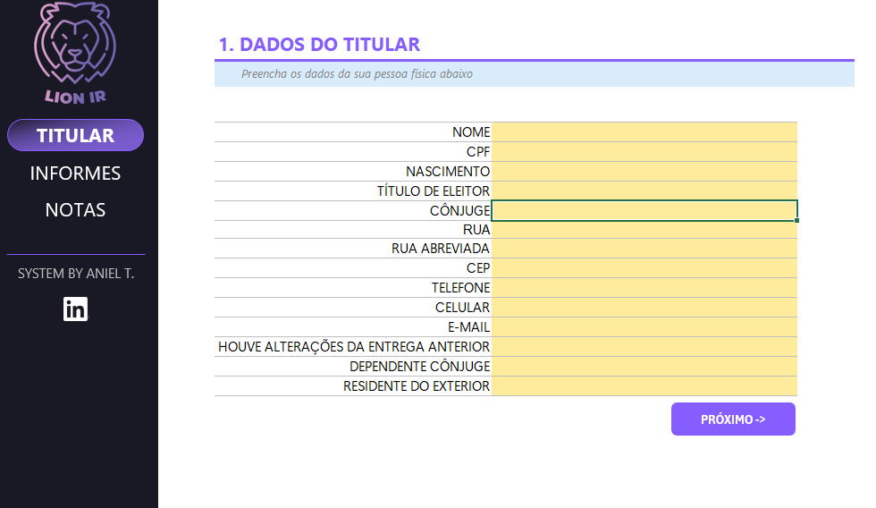

# 🦁 Lion IR — Planilha de Organização para o Imposto de Renda

O **Lion IR** é uma planilha inteligente desenvolvida para ajudar pessoas físicas na organização dos dados necessários para a declaração anual do Imposto de Renda. Com interface limpa, proteção contra edição acidental e gráficos automáticos, a ferramenta oferece praticidade, segurança e clareza na preparação dos informes.

---

## 📌 Funcionalidades

- **🔐 Proteção contra erros acidentais**  
  Campos de preenchimento e fórmulas bloqueadas estrategicamente, evitando alterações indevidas.

- **🧾 Cadastro do Titular**  
  Inclui dados pessoais, endereço, CPF, dependentes, nome do contador, e mais.

- **🏦 Informe de Rendimentos Bancários**  
  Permite o registro de múltiplos bancos com campos para o valor total recebido e nome do arquivo do informe bancário.

- **💼 Notas Bancárias e Receitas Diversas**  
  Organize rendimentos mensais provenientes de:
  - Holerites (CLT)
  - CNPJs próprios
  - Trabalhos como Freelancer
  - Outras fontes

- **📊 Gráficos Automáticos**  
  Geração automática de visualizações com a **distribuição de receitas por categoria**, ao preencher os valores.

---

## 🎯 Objetivo

Facilitar a **reunião e organização de documentos e informações financeiras** para a entrega da declaração anual de IRPF, oferecendo uma visão consolidada da situação do contribuinte e reduzindo riscos de omissão.

---

## 📸 Capturas de Tela

### Tela de Cadastro do Titular

_Visão da aba para preenchimento dos dados do titular e dependentes._

## ✅ Requisitos

- Microsoft Excel (recomendado para compatibilidade total)  
- Pode ser adaptado para Google Sheets com ajustes

---

## 📁 Como usar

1. **Baixe a planilha** `.xlsx` do repositório.
2. Vá até a aba **"Titular"** e preencha seus dados básicos.
3. Em **"Informes"**, registre os bancos, valores recebidos e nome dos arquivos dos informes.
4. Preencha a aba **"Notas"** com entradas mensais, categorizadas conforme sua fonte de receita.
5. Visualize o **gráfico de distribuição de renda** gerado automaticamente.

---

## 📎 Autor

**Desenvolvido por Aniel T.**  
[LinkedIn](https://www.linkedin.com/in/anieltorres/) <!-- insira seu link aqui se desejar -->

---

## 📄 Licença
Você pode usar, modificar e distribuir com liberdade, mantendo os créditos ao autor.
